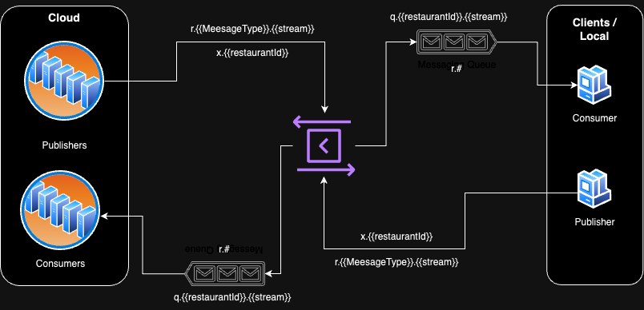

# Getting Started

### Reference Documentation
For further reference, please consider the following sections:

* [Official Apache Maven documentation](https://maven.apache.org/guides/index.html)
* [Spring Boot Maven Plugin Reference Guide](https://docs.spring.io/spring-boot/docs/3.1.6/maven-plugin/reference/html/)
* [Create an OCI image](https://docs.spring.io/spring-boot/docs/3.1.6/maven-plugin/reference/html/#build-image)
* [Spring for RabbitMQ](https://docs.spring.io/spring-boot/docs/3.1.6/reference/htmlsingle/index.html#messaging.amqp)

### Guides
The following guides illustrate how to use some features concretely:

* [Messaging with RabbitMQ](https://spring.io/guides/gs/messaging-rabbitmq/)

# Queuing Topology



There are various types of exchanges available, namely

* Direct Exchange
* Topic Exchange
* Fanout Exchange
* Headers Exchange
* Default Exchange
* Dead Letter Exchange

Out of which, we are using **Topic Exchange** here which enables us to do wildcard matches between the routing key and the queue binding’s routing pattern.

Following is the pattern for exchange names

````
x.{{restaurantId}}
````

This is how a routing key template is defined

````
r.{{MessageType}}.{{stream}}
````

And, here's the pattern for queue names
````
q.{{restaurantId}}.{{stream}}
````

with the binding regex as
````
r.#
````
meaning that all messages from that particular restaurant/exchange should be delivered.

Where

* `restaurantId` is the unique ID of a restaurant
* `stream` is the direction of the message flow, it has following 2 values
  * `up` stream means data is flowing from local servers to cloud servers
  * `down` stream means data is flowing from cloud to local servers
* `MessageType` is the type of event e.g.
  * MenuCreated
  * TableUpdated
  * OrderCreated
  * ...

The project has 4 profiles to run the application in different modes
1. `cloudPublisher` it mimics the behaviour where cloud is publishing data downstream
2. `cloudReceiver` behaves as a cloud receiver listening to all posible upstream data
3. `localPublisher` publishes data only related to a particular `restaurantId`
4. `localReceiver` listens to downstream queue but only for a particular `restaurantId`

Following command helps in running the app in various profile modes

````
mvn spring-boot:run -Dspring-boot.run.profiles=cloudPublisher
````

### Sample Curl Request
````
curl --location 'localhost:8080/api/publish/message' \
--header 'Content-Type: application/json' \
--data '{
    "restaurant_id": "3",
    "payload": {
        "key1": "v1",
        "key2": "v2",
        "key3": {
            "key4": "v4",
            "key5": [
                1, 2, 3
            ]
        }
    }
}'
````
